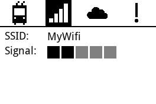
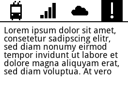

# Arriva

Arriva is a Raspberry Pi-based system designed to display public transport connections and alerts at a specified location. It integrates with APIs to fetch real-time data and uses an e-paper display for energy-efficient, clear, and persistent information.

Illustration of the information that is being displayed:
<p align="center" style="display: flex; justify-content: center; gap: 20px;">
  
  
  
</p>

## Features

- **Real-Time Data**: Fetches live public transport connections and alerts using the [OpenTransportData API](https://opentransportdata.swiss/).
- **E-Paper Display**: Utilizes Waveshare's 2.7-inch e-paper display for low-power, high-contrast visuals.
- **Configurable**: Easily customize settings via YAML configuration files.
- **Button Controls**: Navigate through different display modes using physical buttons.
- **Error Handling**: Displays error messages when issues occur (e.g., network errors).

## Project Structure

```
├── arriva.py                # Main application logic
├── backend/                 # Handles API queries and data processing
│   ├── connections_query.py # Fetches connection data
│   ├── signal_query.py      # Fetches signal data
│   └── credentials.yaml     # API credentials
├── display/                 # Manages display logic
│   ├── displays.py          # Frame rendering logic
│   └── test_display_dynamic_image.py # Display tests
├── waveshare_epd/           # E-paper display drivers
│   ├── epd2in7_V2.py        # Driver for 2.7-inch e-paper display
│   └── epdconfig.py         # Hardware configuration
├── config/                  # Configuration files
│   └── arriva_config.yaml   # User-defined settings
├── tests/                   # Unit tests
├── setup.py                 # Installation script
└── readme.md                # Project documentation
```

## Installation

1. Clone the repository:
   ```bash
   git clone https://github.com/nicoscore99/arriva.git
   cd arriva
   ```

2. Install dependencies:
   ```bash
   pip install -r requirements.txt
   ```

3. Set up the API credentials:
   - Edit `backend/credentials.yaml` with your API key and URL.

4. Configure the system:
   - Modify `config/arriva_config.yaml` to set your preferences.

## Usage

Run the main application:
```bash
python arriva.py
```

The system will display a welcome message on startup and then enter the main loop to fetch and display real-time data.

## Configuration

### `config/arriva_config.yaml`
- `Haltestelle`: Departure location name
- `Haltestelle_Didok`: Didok number of your departure location. To be found [here](https://opendata.swiss/de/dataset/dienststellen-gemass-opentransportdata-swiss).

### `backend/credentials.yaml`
This file you need to add by yourself.
- `api_key`: Your API key for accessing the OpenTransportData API.
- `url`: The API endpoint.

## Hardware Requirements

- Raspberry Pi (any model with GPIO support)
- Waveshare 2.7-inch e-paper display
- Buttons connected to GPIO pins
- Power supply

## Development

### Running Tests
Run the unit tests using `pytest`:
```bash
pytest
```

### Adding Dependencies
Add new dependencies to `requirements.txt` and update `setup.py` if necessary.

## License

This project is licensed under the MIT License. See the `LICENSE` file for details.

## Acknowledgments

- [Waveshare](https://www.waveshare.com/) for the e-paper display and drivers.
- [OpenTransportData](https://opentransportdata.swiss/) for providing real-time transport data.

## Contact

For questions or support, contact [Nicolas Stillhard](mailto:nicolas.stillhard@gmail.com).

## TODO

Stuff that can be improved:

- Expand EPD functionality to prevent blinking every time the screen changes
- Flake8 the code
- Implement functionality for button 4